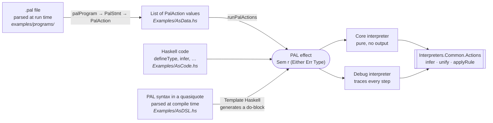
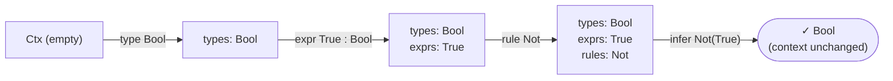
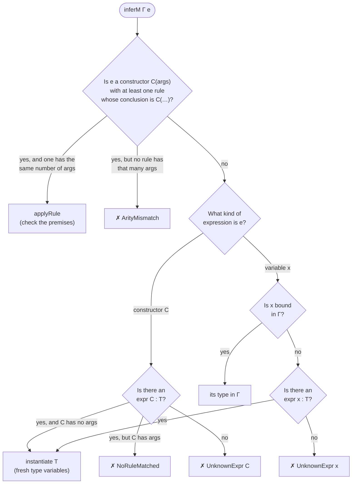
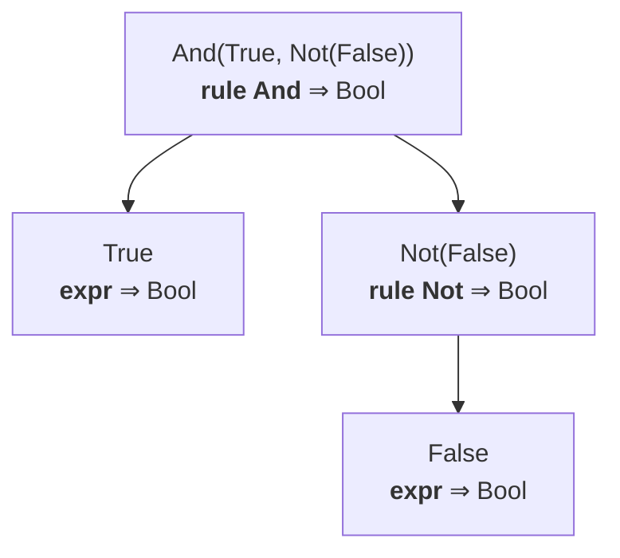
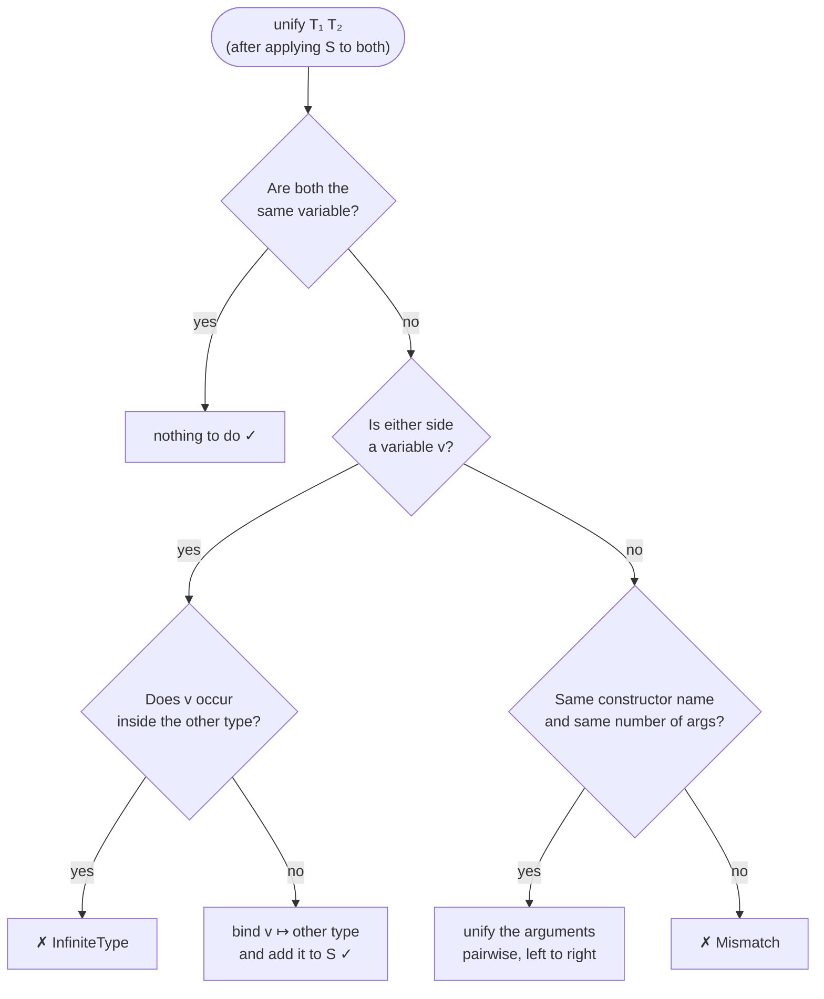
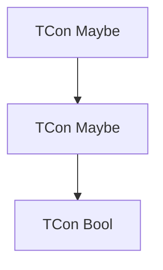
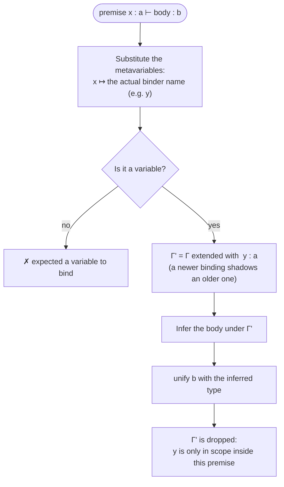
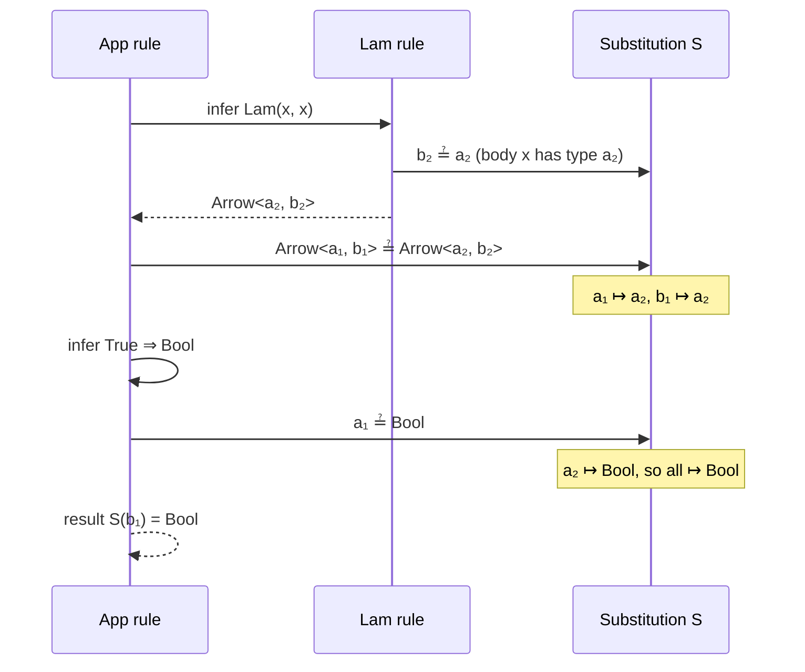

# PAL Tutorial — Building Type Systems Step by Step

This tutorial goes through the programs in [`examples/`](examples/) one at a
time. It explains the type theory each one relies on and traces what the
typechecker does at every step.

You don't need any type theory to start. Each idea is introduced right before
the first example that needs it:

| Part | Example(s)                     | Theory introduced                                   |
| ---- | ------------------------------ | --------------------------------------------------- |
| 0    | —                              | Running the examples                                |
| 1    | —                              | Types, terms, judgments, inference rules            |
| 2    | —                              | How PAL is put together                             |
| 3    | `dsl/logic`                    | Derivation trees, rule matching, arity              |
| 4    | `code/arith`                   | Type variables, polymorphic rules                   |
| 5    | —                              | Substitution and unification                        |
| 6    | `dsl/maybe`                    | Type constructors with parameters, instantiation    |
| 7    | `data/pairs`, `data/generated` | Destructuring types; programs as data               |
| 8    | `code/lambda`, `file/stlc`     | Typing contexts (Γ), hypothetical judgments, binders |
| 9    | —                              | Limitations: let-polymorphism and others            |
| 10   | —                              | Exercises and a cheat sheet                         |

---

## 0. Running the examples

```sh
./run-examples.sh --list             # see what's available
./run-examples.sh                    # run everything, results only
./run-examples.sh dsl/logic          # run one example
./run-examples.sh --trace dsl/logic  # full trace, with the context after every step
```

A result line looks like this:

```
[PAL] ✓ And(True, Not(False)) :: Bool                                     ← success
[PAL] ✗ Not(True, False) -> [Error] Arity mismatch: expected 1 arg(s), got 2  ← failure
```

All the outputs quoted below come from actually running the examples.

---

## 1. Basic theory: what a type system is

A **type system** is a set of rules for deciding which programs make sense.
`1 + 2` makes sense. `true + 2` usually doesn't. A type system catches the
second one *without running the program*.

You describe a type system with four ingredients, and PAL has a keyword for
each:

| Ingredient          | What it is                                           | PAL syntax                 |
| ------------------- | ---------------------------------------------------- | -------------------------- |
| **Types**           | The categories values belong to                      | `type Bool`                |
| **Terms** (exprs)   | The program fragments being checked                  | `True`, `Add(x, y)`        |
| **Axioms**          | Terms whose type is simply given                     | `expr True : Bool`         |
| **Inference rules** | How to get a compound term's type from its parts     | `rule Add: … -> …`         |

### 1.1 Judgments

The basic statement in a type system is a **judgment**:

```
e : T        "expression e has type T"
```

For example, `True : Bool` and `Add(LitInt, LitInt) : Num`.

### 1.2 Inference rules

An inference rule says: *if the judgments above the line hold, the judgment
below the line holds too.*

```
  premise₁    premise₂    …
 ─────────────────────────── (RuleName)
         conclusion
```

Here is the `Add` rule in textbook notation and in PAL:

```
  x : Num    y : Num                rule Add:
 ──────────────────── (Add)           x : Num
   Add(x, y) : Num                    y : Num
                                    ->
                                      Add(x, y) : Num
```

Inside a rule, `x` and `y` are **metavariables**: placeholders that can stand
for *any* expression. The rule reads "for any expressions x and y, if x is a
Num and y is a Num, then `Add(x, y)` is a Num."

An `expr` declaration is a rule with no premises, called an **axiom**:

```
 ─────────────── (expr)
  True : Bool
```

### 1.3 Derivations

To typecheck a term, you stack rules into a **derivation tree**. The term you
want is at the root, and every branch ends in an axiom. If you can build such a
tree, the term is *well-typed*. If you can't, it is a *type error*.

Typechecking is therefore a search for a derivation. PAL performs that search
automatically from the rules you give it.

---

## 2. How PAL is put together

A PAL program can be written four ways. All of them end up as the same
`PAL` effect and run through the same inference engine:



The `PAL` effect ([src/Types.hs](src/Types.hs)) has exactly four operations:

```haskell
data PAL m a where
  DefineType :: TypeDecl   -> PAL m ()                -- type Bool
  DefineExpr :: ExprDecl   -> PAL m ()                -- expr True : Bool
  DefineRule :: TypingRule -> PAL m ()                -- rule Add: …
  Infer      :: Expr       -> PAL m (Either Err Type) -- infer Add(…)
```

The first three add an entry to a **context** (`Ctx`), which records
everything the language knows so far. `Infer` reads the context and tries to
build a derivation:



Statements run **in order**, so a rule has to be defined before an `infer`
that uses it.

### 2.1 The inference algorithm at a glance

`inferM` in [src/Interpreters/Common/Actions.hs](src/Interpreters/Common/Actions.hs)
decides how to type an expression:



Rules take priority. Declared constants are the fallback. Rules are matched
by the **constructor in their conclusion** (`Add` in `Add(x, y)`), not by the
name after `rule`.

---

## 3. Example `dsl/logic`: your first derivations

Source: [examples/Examples/AsDSL.hs](examples/Examples/AsDSL.hs)

```haskell
type Bool
type Num

expr True   : Bool
expr False  : Bool
expr LitInt : Num

rule Not:              rule And:              rule Or:
  x : Bool               x : Bool               x : Bool
->                       y : Bool               y : Bool
  Not(x) : Bool        ->                     ->
                         And(x, y) : Bool       Or(x, y) : Bool

infer And(True, Not(False))           -- Bool
infer Or(And(True, False), Not(True)) -- Bool
infer Not(True, False)                -- ✗ arity mismatch
infer Or(True, LitInt)                -- ✗ Num is not Bool
```

Output:

```
[PAL] ✓ And(True, Not(False)) :: Bool
[PAL] ✓ Or(And(True, False), Not(True)) :: Bool
[PAL] ✗ Not(True, False) -> [Error] Arity mismatch: expected 1 arg(s), got 2
[PAL] ✗ Or(True, LitInt) -> [Error] Type mismatch: expected Bool, got Num
```

### Step by step: `infer And(True, Not(False))`

**Step 1: Find a rule.** The expression is the constructor `And` with 2
arguments. The `And` rule's conclusion is `And(x, y)`, also with 2 arguments,
so the rule applies.

**Step 2: Match the conclusion.** PAL lines the pattern up with the
expression and records what each metavariable stands for:

```
pattern:     And(  x  ,     y      )
expression:  And( True, Not(False) )

  x ↦ True
  y ↦ Not(False)
```

**Step 3: Check each premise.** Each metavariable is replaced by its
expression, and PAL infers that expression's type recursively:

| Premise    | Becomes             | Recursive inference                          | Required | OK? |
| ---------- | ------------------- | -------------------------------------------- | -------- | --- |
| `x : Bool` | `True : Bool`?      | `True` has no rule, but `expr True : Bool` exists → `Bool` | `Bool` | ✓ |
| `y : Bool` | `Not(False) : Bool`? | apply the `Not` rule: `x ↦ False`, and `False : Bool` ✓ → `Bool` | `Bool` | ✓ |

**Step 4: Return the conclusion's type.** That is `Bool`.

The recursion produced this derivation tree:

```
                          ─────────────── (expr)
                           False : Bool
 ─────────────── (expr)   ───────────────── (Not)
   True : Bool             Not(False) : Bool
 ───────────────────────────────────────────── (And)
          And(True, Not(False)) : Bool
```

The recursion follows the shape of the term:



### Why `Not(True, False)` fails

There is a `Not` rule, but its conclusion `Not(x)` takes **1** argument and
the expression has **2**. No rule fits, so PAL reports
`Arity mismatch: expected 1 arg(s), got 2`.

### Why `Or(True, LitInt)` fails

The rule matches (`x ↦ True`, `y ↦ LitInt`). The first premise holds. The
second premise needs `LitInt : Bool`, but `LitInt` is declared as `Num`:

```
  True : Bool ✓     LitInt : Bool ✗   (it is Num)
 ──────────────────────────────────── (Or)
       Or(True, LitInt) : Bool        ← can't be derived
```

> **What to remember:** typechecking is a recursive, rule-directed search for a
> derivation tree. An error means some premise can't be satisfied.

---

## 4. Example `code/arith`: type variables

Source: [examples/Examples/AsCode.hs](examples/Examples/AsCode.hs). This
example is written as Haskell code, but in PAL syntax it reads:

```
type Num   type Bool
expr Zero : Num    expr One : Num    expr True : Bool    expr False : Bool

rule Add:     x : Num,  y : Num            ->  Add(x, y)    : Num
rule IsZero:  n : Num                      ->  IsZero(n)    : Bool
rule If:      c : Bool, t : a,  e : a      ->  If(c, t, e)  : a
```

The `If` rule contains a **type variable** `a`. In PAL, any type name that
starts with a **lowercase** letter is a type variable.

### 4.1 Theory: polymorphic rules

What type does `If(c, t, e)` have? It depends on the branches. If both are
`Num`, the result is `Num`. If both are `Bool`, it's `Bool`. Writing one rule
per type would be repetitive, so we write one rule with a variable:

```
  c : Bool    t : a    e : a
 ──────────────────────────── (If)
      If(c, t, e) : a
```

You can read this as "**for every** type `a`…". The rule is *polymorphic*.
The same `a` appears three times, which says three things at once:

1. the then-branch and the else-branch must have the **same** type, and
2. the whole `If` has **that** type,
3. whatever that type turns out to be.

The typechecker has to work out what `a` is each time the rule is used. It
does this with **unification**, covered in Part 5.

### Output

```
[PAL] ✓ Add(One, Add(One, Zero)) :: Num
[PAL] ✓ IsZero(Add(One, One)) :: Bool
[PAL] ✓ If(IsZero(Zero), One, Zero) :: Num
[PAL] ✗ If(True, One, False) -> [Error] Type mismatch: expected Num, got Bool
[PAL] ✗ If(One, One, Zero) -> [Error] Type mismatch: expected Bool, got Num
[PAL] ✗ Mul(One, One) -> [Error] Unknown expression → Mul
```

### Step by step: `infer If(IsZero(Zero), One, Zero)`

**Step 1: Give the rule fresh variables.** Every use of a rule gets its own
copy of the type variables. PAL calls them `'0`, `'1`, …; we'll write `a₁`.

```
  c : Bool    t : a₁    e : a₁
 ────────────────────────────── (If)
      If(c, t, e) : a₁
```

**Step 2: Match the conclusion.** `c ↦ IsZero(Zero)`, `t ↦ One`, `e ↦ Zero`.

**Step 3: Check the premises in order**, keeping a **substitution** `S` that
records what each type variable has been found to be:

| # | Premise    | Inferred type of the expression | Unify required with inferred | S afterwards  |
| - | ---------- | ------------------------------- | ---------------------------- | ------------- |
| 1 | `c : Bool` | `IsZero(Zero)` → `Bool`         | `Bool ≟ Bool` ✓              | `{}`          |
| 2 | `t : a₁`   | `One` → `Num`                   | `a₁ ≟ Num` → bind it         | `{a₁ ↦ Num}`  |
| 3 | `e : a₁`   | `Zero` → `Num`                  | `S(a₁) = Num ≟ Num` ✓        | `{a₁ ↦ Num}`  |

**Step 4: Return the conclusion with S applied.** `S(a₁) = Num`. ✓

### Step by step: why `If(True, One, False)` fails

| # | Premise    | Inferred  | Unify                 | Result                        |
| - | ---------- | --------- | --------------------- | ----------------------------- |
| 1 | `c : Bool` | `Bool`    | `Bool ≟ Bool` ✓       | `{}`                          |
| 2 | `t : a₁`   | `Num`     | `a₁ ≟ Num`            | `{a₁ ↦ Num}`                  |
| 3 | `e : a₁`   | `Bool`    | `S(a₁) = Num ≟ Bool`  | ✗ **expected Num, got Bool**  |

Once the then-branch has fixed `a₁ = Num`, the else-branch has to be `Num`
too. That's exactly what the shared `a` in the rule says.

`If(One, One, Zero)` fails at premise 1, because the condition is `Num` and
not `Bool`. `Mul(One, One)` fails because there's no `Mul` rule and no
`expr Mul`, so `Mul` is unknown.

---

## 5. Theory: substitution and unification

This is the core of the inference engine, so it gets its own part.

### 5.1 Substitution

A **substitution** `S` is a finite map from type variables to types:

```
S = { a ↦ Num,  b ↦ Arrow<Num, c> }
```

**Applying** `S` to a type replaces each variable in its domain:

```
S( Pair<a, b> ) = Pair<Num, Arrow<Num, c>>
S( c )          = c                          (c isn't in S, so it stays)
```

This is `applySubst` in the code.

### 5.2 Unification

**Unifying** two types `T₁ ≟ T₂` means finding a substitution that makes them
equal. PAL's `unify` first applies the current `S` to both sides, then
compares them structurally:



Some worked unifications:

| Problem                              | Result                                      |
| ------------------------------------ | ------------------------------------------- |
| `Num ≟ Num`                          | ✓ `{}`                                      |
| `Num ≟ Bool`                         | ✗ mismatch: different constructors          |
| `a ≟ Num`                            | ✓ `{a ↦ Num}`                               |
| `Pair<a, Bool> ≟ Pair<Num, b>`       | ✓ `{a ↦ Num, b ↦ Bool}`                     |
| `Arrow<a, a> ≟ Arrow<Num, Bool>`     | `a ↦ Num`, then `Num ≟ Bool` ✗              |
| `Maybe<a> ≟ Pair<a, a>`              | ✗ mismatch: `Maybe` vs `Pair`               |
| `a ≟ Arrow<a, b>`                    | ✗ **infinite type** (the occurs check)      |

### 5.3 The occurs check

Why is `a ≟ Arrow<a, b>` an error? Binding `a ↦ Arrow<a, b>` would make
`a = Arrow<Arrow<Arrow<…, b>, b>, b>`, an infinitely large type. PAL refuses
and reports `InfiniteType`. A real program that triggers this appears in
Part 8.

### 5.4 Fresh variables and pretty names

- Every time a rule is applied, its variables are **renamed to fresh ones**
  (`freshen`). Without this, two uses of `If` in one expression would be
  forced to share the same `a`.
- Fresh names start with `'` (`'0`, `'1`, …). The parser can never produce
  such a name, so they can't clash with yours.
- When inference finishes, any variables still unsolved are renamed to `a`,
  `b`, `c`, … in order of appearance (`normalize`). That's why you see
  `Arrow<a, a>` rather than `Arrow<'3, '3>`.

---

## 6. Example `dsl/maybe`: parameterised types and polymorphic constants

Source: [examples/Examples/AsDSL.hs](examples/Examples/AsDSL.hs)

```haskell
type Num
type Bool
type Maybe

expr LitInt  : Num
expr True    : Bool
expr Nothing : Maybe<a>         -- a polymorphic constant

rule Just:
  x : a
->
  Just(x) : Maybe<a>

rule FromMaybe:
  d : a
  m : Maybe<a>
->
  FromMaybe(d, m) : a
```

Output:

```
[PAL] ✓ Just(LitInt) :: Maybe<Num>
[PAL] ✓ Just(Just(True)) :: Maybe<Maybe<Bool>>
[PAL] ✓ FromMaybe(LitInt, Just(LitInt)) :: Num
[PAL] ✓ Nothing :: Maybe<a>
[PAL] ✓ FromMaybe(True, Nothing) :: Bool
[PAL] ✗ FromMaybe(LitInt, Just(True)) -> [Error] Type mismatch: expected Num, got Bool
```

### 6.1 Theory: type constructors

`Maybe` isn't a type on its own. It's a **type constructor**: it takes a type
and produces one. `Maybe<Num>`, `Maybe<Bool>` and `Maybe<Maybe<Bool>>` are all
different types. Internally a type is a tree:

```haskell
data Type = TCon String [Type]   -- Maybe<Num>  =  TCon "Maybe" [TCon "Num" []]
          | TVar String          -- a           =  TVar "a"
```



<sub>The tree for `Maybe<Maybe<Bool>>`.</sub>

Unification walks both trees at the same time, which is the "same
constructor → unify the arguments pairwise" branch in Part 5.

### 6.2 Theory: instantiation

`Nothing : Maybe<a>` is a constant, but it's polymorphic: `Nothing` can be a
"maybe Num" or a "maybe Bool". Every time PAL looks up a declared `expr`, it
**instantiates** the declared type, giving each type variable a fresh copy
(`instantiate`). So every `Nothing` gets its own `a`. That's why
`infer Nothing` reports `Maybe<a>`: nothing constrains `a`, and it's printed
with its pretty name.

### Step by step: `infer FromMaybe(True, Nothing)`

1. **Rule.** `FromMaybe` gets fresh variables: premises `d : a₁`, `m : Maybe<a₁>`, conclusion `a₁`.
2. **Match.** `d ↦ True`, `m ↦ Nothing`.
3. **Premises:**

   | # | Premise         | Inferred                                         | Unify                                   | S                          |
   | - | --------------- | ------------------------------------------------ | --------------------------------------- | -------------------------- |
   | 1 | `d : a₁`        | `True` → `Bool`                                  | `a₁ ≟ Bool`                             | `{a₁ ↦ Bool}`              |
   | 2 | `m : Maybe<a₁>` | `Nothing` → instantiate `Maybe<a>` → `Maybe<a₂>` | `Maybe<Bool> ≟ Maybe<a₂>` → `Bool ≟ a₂` | `{a₁ ↦ Bool, a₂ ↦ Bool}`   |

4. **Result.** `S(a₁) = Bool`. ✓

### Why `FromMaybe(LitInt, Just(True))` fails

Premise 1 fixes `a₁ ↦ Num`. Premise 2 infers `Just(True) : Maybe<Bool>`, and
then `Maybe<Num> ≟ Maybe<Bool>` reduces to `Num ≟ Bool`, which fails. The
default value and the contents of the `Maybe` have to agree.

---

## 7. Examples `data/pairs` and `data/generated`: programs as data

Source: [examples/Examples/AsData.hs](examples/Examples/AsData.hs)

These examples are written as **plain Haskell lists** of `PalAction`, not as
code or PAL syntax:

```haskell
data PalAction
  = ADefineType TypeDecl
  | ADefineExpr ExprDecl
  | ADefineRule TypingRule
  | AInfer Expr
```

`runPalActions` folds over the list and turns each action into the matching
effect. Because the program is just a list, you can **compute** it.

### 7.1 `data/pairs`: taking types apart

```
rule Pair:  x : a,  y : b         ->  Pair(x, y) : Pair<a, b>
rule Fst:   p : Pair<a, b>        ->  Fst(p) : a
rule Snd:   p : Pair<a, b>        ->  Snd(p) : b
```

`Pair` **builds** a structured type. `Fst` and `Snd` **take it apart**: their
premise requires a `Pair<a, b>`, and unification pulls `a` and `b` out of
whatever type was actually inferred.

```
[PAL] ✓ Pair(LitInt, True) :: Pair<Num, Bool>
[PAL] ✓ Fst(Pair(LitInt, True)) :: Num
[PAL] ✓ Snd(Pair(LitInt, True)) :: Bool
[PAL] ✓ Snd(Pair(True, Pair(LitInt, LitInt))) :: Pair<Num, Num>
[PAL] ✗ Fst(LitInt) -> [Error] Type mismatch: expected Pair<a, b>, got Num
```

Step by step for `Fst(Pair(LitInt, True))`:

```
 1. Fst rule, fresh vars:        p : Pair<a₁, b₁>   ⊢   Fst(p) : a₁
 2. Match:                       p ↦ Pair(LitInt, True)
 3. Infer Pair(LitInt, True):    (Pair rule, fresh a₂ b₂)
       LitInt : a₂  → a₂ ↦ Num
       True   : b₂  → b₂ ↦ Bool
       result Pair<a₂, b₂>
 4. Unify  Pair<a₁, b₁>  ≟  Pair<Num, Bool>
       a₁ ≟ Num   → a₁ ↦ Num
       b₁ ≟ Bool  → b₁ ↦ Bool
 5. Result S(a₁) = Num ✓
```

`Fst(LitInt)` fails because `Pair<a₁, b₁> ≟ Num` compares constructors `Pair`
and `Num`, which differ.

### 7.2 `data/generated`: generating programs

```haskell
addChain :: Int -> Expr
addChain 0 = lit "LitInt"
addChain n = ECon "Add" [lit "LitInt", addChain (n - 1)]

generated = prelude <> [ADefineRule addRule]
                    <> fmap (AInfer . addChain) [1, 2, 3]
                    <> [AInfer (ECon "Add" [addChain 2, lit "True"])]
```

```
[PAL] ✓ Add(LitInt, LitInt) :: Num
[PAL] ✓ Add(LitInt, Add(LitInt, LitInt)) :: Num
[PAL] ✓ Add(LitInt, Add(LitInt, Add(LitInt, LitInt))) :: Num
[PAL] ✗ Add(Add(LitInt, Add(LitInt, LitInt)), True) -> [Error] Type mismatch: expected Num, got Bool
```

The derivation tree for `addChain n` has depth `n + 1`. The recursive search
handles any depth. In the last query, the left argument (a deep chain) checks
out, and the error comes from the right argument, `True`.

The `.pal` file loader reuses this machinery: [Examples/AsFile.hs](examples/Examples/AsFile.hs)
parses the file into `PalStmt`s, maps each one to a `PalAction`, and calls
`runPalActions`.

---

## 8. Examples `code/lambda` and `file/stlc`: variables and binders

Everything so far worked on **closed** terms built from constants. Real
languages have **variables** bound by functions (`λx. …`) and `let`. This
needs one more piece of theory.

### 8.1 Theory: typing contexts (Γ)

What is the type of `x` in the body of `λx. x`? It depends on what we've
**assumed** about `x`. A **typing context** Γ ("gamma") is a list of such
assumptions:

```
Γ = { x : a,  f : Arrow<a, b> }
```

Judgments now carry a context. `Γ ⊢ e : T` reads "assuming Γ, e has type T".
The **variable rule** says a variable has whatever type Γ gives it:

```
   (x : T) ∈ Γ
  ───────────── (Var)
    Γ ⊢ x : T
```

In PAL, Γ is the `ctx'env` field of the context, and this rule is built in:
see the `EVar` branch of the flowchart in §2.1.

### 8.2 Theory: hypothetical premises

A **binder** like `λx. body` adds an assumption while its body is checked.
This is the **hypothetical premise** `x : a ⊢ body : b`:

```
   Γ, x : a ⊢ body : b
  ─────────────────────────────── (Lam)
   Γ ⊢ Lam(x, body) : Arrow<a, b>
```

"If, after assuming `x : a`, the body has type `b`, then the lambda is a
function from `a` to `b`." In PAL you write `|-` (or `⊢`) in a premise:

```haskell
rule Lam:
  x : a |- body : b
->
  Lam(x, body) : Arrow<a, b>

rule App:
  f : Arrow<a, b>
  x : a
->
  App(f, x) : b
```

Function application then just matches argument types:

```
  Γ ⊢ f : Arrow<a, b>    Γ ⊢ x : a
 ──────────────────────────────────── (App)
          Γ ⊢ App(f, x) : b
```

How PAL handles a hypothesis (`applyRule`):



### 8.3 Step by step: `infer Lam(x, x)` → `Arrow<a, a>`

```
1. Lam rule, fresh vars:   x : a₁ ⊢ body : b₁    ⟹   Lam(x, body) : Arrow<a₁, b₁>
2. Match:                  x ↦ x,  body ↦ x
3. Premise:   Γ' = { x : a₁ }
              infer x under Γ'     → a₁         (Var rule)
              unify b₁ ≟ a₁        → S = { b₁ ↦ a₁ }
4. Result:    S(Arrow<a₁, b₁>) = Arrow<a₁, a₁>
5. Pretty names:  a₁ → a          ⟹   Arrow<a, a>  ✓
```

Nothing constrains `a₁`, so the identity function works on **any** type. The
result keeps the variable.

### 8.4 Step by step: `infer App(Lam(x, x), True)` → `Bool`

This is the most involved example in the tutorial. Watch how information
moves *into* the lambda from its argument:

| Step | What happens                                     | Unification                                  | S                                   |
| ---- | ------------------------------------------------ | -------------------------------------------- | ----------------------------------- |
| 1    | `App` rule, fresh: `f : Arrow<a₁,b₁>`, `x : a₁`, result `b₁` | —                                | `{}`                                |
| 2    | Match: `f ↦ Lam(x, x)`, `x ↦ True`               | —                                            | `{}`                                |
| 3    | Premise 1: infer `Lam(x, x)` (fresh `a₂`, `b₂`); inside, `x : a₂` and the body gives `b₂ ≟ a₂` | `b₂ ↦ a₂` | `{b₂↦a₂}`                    |
| 4    | …the lambda returns `Arrow<a₂, b₂>`; unify with `Arrow<a₁, b₁>` | `a₁ ≟ a₂`, `b₁ ≟ a₂`          | `{b₂↦a₂, a₁↦a₂, b₁↦a₂}`             |
| 5    | Premise 2: infer `True` → `Bool`; unify with `a₁` | `S(a₁) = a₂ ≟ Bool` → `a₂ ↦ Bool`           | everything ↦ `Bool`                 |
| 6    | Result: `S(b₁)`                                  | —                                            | **`Bool`** ✓                        |

The same flow as a sequence diagram:



### 8.5 The `file/stlc` example

[examples/programs/stlc.pal](examples/programs/stlc.pal) puts all of this
together into a fragment of the **Simply Typed Lambda Calculus**, adding
built-in functions and `Let`:

```
expr Not    : Arrow<Bool, Bool>     -- built-ins are just constants of function type
expr IsZero : Arrow<Num, Bool>

rule Let:
  value : a
  x : a |- body : b
->
  Let(x, value, body) : b
```

```
[PAL] ✓ App(Not, True) :: Bool
[PAL] ✓ If(App(IsZero, LitInt), LitInt, LitInt) :: Num
[PAL] ✓ Lam(x, x) :: Arrow<a, a>
[PAL] ✓ Lam(x, App(Not, x)) :: Arrow<Bool, Bool>
[PAL] ✓ Lam(f, Lam(x, App(f, App(f, x)))) :: Arrow<Arrow<a, a>, Arrow<a, a>>
[PAL] ✓ App(Lam(x, If(x, LitInt, LitInt)), True) :: Num
[PAL] ✓ Let(n, LitInt, App(IsZero, n)) :: Bool
[PAL] ✓ Lam(x, Lam(x, x)) :: Arrow<a, Arrow<b, b>>
[PAL] ✗ App(Not, LitInt) -> [Error] Type mismatch: expected Bool, got Num
[PAL] ✗ App(Lam(x, App(Not, x)), LitInt) -> [Error] Type mismatch: expected Bool, got Num
[PAL] ✗ Lam(x, App(x, x)) -> [Error] Infinite type: a ~ Arrow<a, b>
[PAL] ✗ Lam(x, y) -> [Error] Unknown expression → y
```

Some of these are worth a closer look.

**`Lam(x, App(Not, x))` → `Arrow<Bool, Bool>`.** The parameter starts out as
an unknown `a₁`. Passing it to `Not` forces `a₁ ≟ Bool`. This is type
**inference**: the parameter's type was never written anywhere, and the
checker worked it out from how the parameter is used.

**`Lam(f, Lam(x, App(f, App(f, x))))`** applies `f` twice. The inner call
forces `f : Arrow<type of x, r>`. The outer call passes `r` back into `f`, so
`r` must equal the type of `x`. The result is `Arrow<Arrow<a, a>, Arrow<a, a>>`.

**`Lam(x, Lam(x, x))` → `Arrow<a, Arrow<b, b>>` (shadowing).** The inner
`Lam` extends Γ with a new `x : b₂`, which hides the outer `x : a₁`. The body
`x` refers to the inner one, so the result is `b`, not `a`:

```
Γ₀ = {}
└─ Lam(x, …)        Γ₁ = { x : a₁ }
   └─ Lam(x, x)     Γ₂ = { x : b₂ }   ← the inner x hides the outer x
      └─ x          looked up in Γ₂ → b₂
```

**`Lam(x, App(x, x))` → infinite type.** Self-application can't be typed in
the STLC. Here is how the occurs check catches it:

```
Lam:   x : a₁              (x's type is unknown so far)
App:   f ↦ x,  x ↦ x       fresh a₂ (argument), b₂ (result)
  premise f : Arrow<a₂, b₂>     infer x → a₁     a₁ ≟ Arrow<a₂, b₂>   → a₁ ↦ Arrow<a₂, b₂>
  premise x : a₂                infer x → a₁     a₂ ≟ S(a₁) = Arrow<a₂, b₂>
                                                   a₂ occurs inside → ✗ InfiniteType
                                                   (printed: a ~ Arrow<a, b>)
```

**`Lam(x, y)` → unknown expression.** `y` is not in Γ and isn't a declared
`expr`, so it's a free variable with no type.

---

## 9. Limitations

PAL keeps its engine small on purpose. Knowing where it stops is part of
understanding the theory.

### 9.1 No let-polymorphism

In Haskell or ML, `let id = λx. x in (id True, id 1)` typechecks, because
`let` **generalises** `id` to `∀a. a → a`. PAL's `Let` binds `x` with **one
monomorphic type**, so the second use clashes with the first:

```
infer Let(id, Lam(x, x), App(id, True))
  ✓ Bool

infer Let(id, Lam(x, x), Pair(App(id, True), App(id, LitInt)))
  ✗ Type mismatch: expected Bool, got Num
```

(This uses the `Pair` rule from Part 7 and the `Let` rule from Part 8.) The
first use fixes `id : Arrow<Bool, Bool>`, and `App(id, LitInt)` then
fails. *Declared* constants such as `Nothing : Maybe<a>` don't have this
problem, because they are instantiated fresh at every use (§6.2).

### 9.2 Other things to know

- **Type declarations aren't checked.** `type Arrow` doesn't stop you writing
  `Arrow<a, b, c>`, and an undeclared `Pair<a, b>` works too. Declarations are
  informational. Only unification compares types.
- **One rule per constructor and arity.** Matching picks the first rule whose
  conclusion has the right constructor and arity (the most recently defined
  one), and doesn't backtrack to try alternatives.
- **Metavariables in conclusions must be distinct**, or they must match
  identical expressions. A conclusion like `Eq(x, x)` matches only
  syntactically equal arguments.
- **Rules beat constants.** If a constructor has both a rule and an `expr`
  declaration, the rule is tried first.

---

## 10. Exercises

Try these in a copy of a `.pal` file or a quasiquote. Answers are at the end.

1. Add a rule `Eq: x : a, y : a -> Eq(x, y) : Bool`. What do
   `Eq(LitInt, LitInt)` and `Eq(LitInt, True)` return?
2. Add a list type: `expr Nil : List<a>` and a `Cons` rule. What is
   `Cons(True, Cons(True, Nil))`? What about `Cons(True, Cons(LitInt, Nil))`?
3. Predict the type of `Lam(f, Lam(x, App(f, x)))` before running it.
4. Why does `App(Lam(x, x), Lam(y, y))` give `Arrow<a, a>` rather than `Bool`?
5. Write a `Compose(f, g)` rule whose type is `Arrow<a, c>` when
   `f : Arrow<b, c>` and `g : Arrow<a, b>`.

<details>
<summary>Answers</summary>

1. `Bool`, and `✗ Type mismatch: expected Num, got Bool`. The shared `a`
   forces both arguments to have the same type.
2. ```
   rule Cons:
     x  : a
     xs : List<a>
   ->
     Cons(x, xs) : List<a>
   ```
   The first gives `List<Bool>`. The second fails with `expected Bool, got Num`:
   the inner list fixes its element type to `Num`, and the outer `x : a` was
   already fixed to `Bool`.
3. `Arrow<Arrow<a, b>, Arrow<a, b>>`, i.e. "apply".
4. The argument is itself the identity function. The result type is the
   argument's type, `Arrow<a, a>`, and nothing fixes `a`.
5. ```
   rule Compose:
     f : Arrow<b, c>
     g : Arrow<a, b>
   ->
     Compose(f, g) : Arrow<a, c>
   ```
   Try `Compose(Not, IsZero)`. It gives `Arrow<Num, Bool>`.

</details>

---

## Cheat sheet

```
type T                         declare a type name (informational)
expr C : T                     axiom: constant C has type T (T may mention type variables)
rule Name:                     inference rule
  x : T                          plain premise
  x : A |- body : B              hypothetical premise (x is in scope while checking body)
  x : A, y : B ⊢ body : C        several hypotheses
->
  Con(x, y, …) : T               conclusion (matched by constructor + arity)
infer e                        search for a derivation of e

Uppercase name  = constructor / concrete type      Num, Add(x, y), Maybe<Num>
lowercase name  = variable / type variable         x, a
-- comment
```

| Error              | Meaning                                                          |
| ------------------ | ---------------------------------------------------------------- |
| `Type mismatch`    | Unification hit two different type constructors                  |
| `Arity mismatch`   | A rule exists for that constructor, but with a different arg count |
| `Unknown expression` | No rule, no `expr`, and not bound in Γ                         |
| `Infinite type`    | The occurs check failed (`a ~ …a…`)                              |
| `No typing rule matched` | A declared constant was given arguments, but no rule covers it |

| Concept            | Where in the code                                                       |
| ------------------ | ----------------------------------------------------------------------- |
| Types, terms, rules, Γ | [src/Types.hs](src/Types.hs)                                        |
| Search / `inferM`  | [src/Interpreters/Common/Actions.hs](src/Interpreters/Common/Actions.hs) |
| `unify`, `applySubst`, occurs check | same file, "Type variables and unification"            |
| Hypotheses / binders | `applyRule` in the same file                                          |
| Syntax             | [src/Parser/Parser.hs](src/Parser/Parser.hs)                            |
| Trace output       | [src/Interpreters/Debug.hs](src/Interpreters/Debug.hs)                  |
