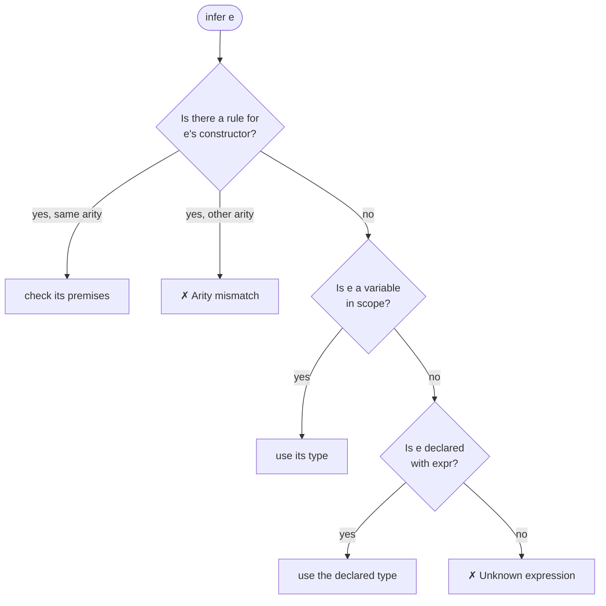
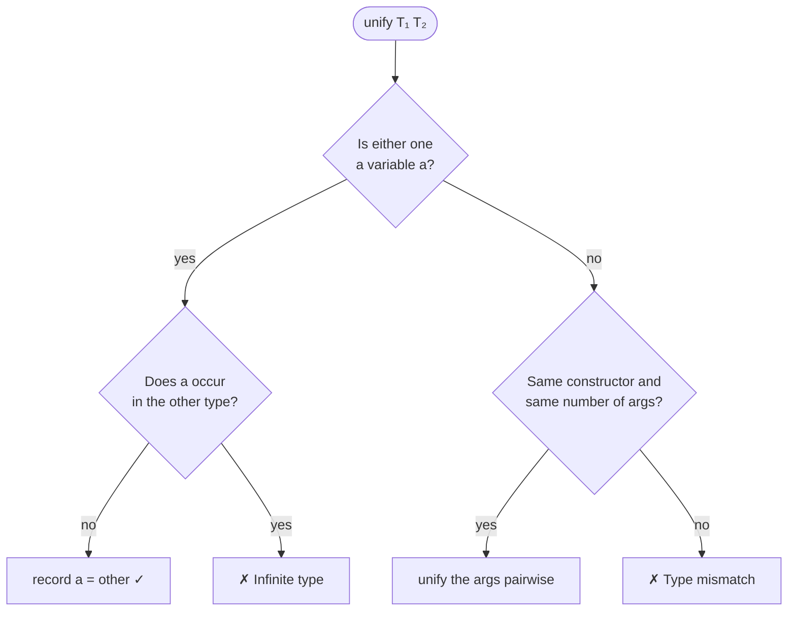

# PAL Tutorial

Learn how type systems work by building some in PAL. Each section adds one idea and traces what the typechecker does with it.

1. [Judgments and rules](#1-judgments-and-rules)
2. [Your first type system](#2-your-first-type-system)
3. [Type variables](#3-type-variables)
4. [Unification](#4-unification)
5. [Polymorphic constants](#5-polymorphic-constants)
6. [Variables and binders](#6-variables-and-binders)
7. [Let-polymorphism](#7-let-polymorphism)
8. [More type systems](#8-more-type-systems)
9. [Exercises](#9-exercises)

To follow along, open a REPL with `nix develop` and then `pal`. The [README](README.md) has the full syntax reference.

---

## 1. Judgments and rules

A type system decides which programs make sense, without running them. It is built from two things.

**Judgments** are statements of the form *expression `:` type*:

```
True : Bool
Add(One, One) : Num
```

**Inference rules** say: *if the premises above the line hold, the conclusion below holds*.

```
  x : Num    y : Num              rule Add:
 ──────────────────── Add           x : Num
   Add(x, y) : Num                  y : Num
                                  ->
                                    Add(x, y) : Num
```

In a rule, `x` and `y` are placeholders that stand for *any* expression. A rule with no premises is an **axiom**. In PAL, you write axioms with `expr`:

```
 ───────────── expr               expr True : Bool
  True : Bool
```

To typecheck an expression, PAL stacks rules into a **derivation tree**, with the expression at the root and axioms at the leaves. If such a tree exists, the expression is well-typed. If not, PAL reports which premise failed.

---

## 2. Your first type system

```haskell
type Bool
type Num
expr True   : Bool
expr False  : Bool
expr LitInt : Num

rule Not:              rule And:
  x : Bool               x : Bool
->                       y : Bool
  Not(x) : Bool        ->
                         And(x, y) : Bool
```

### How `infer And(True, Not(False))` works

1. **Pick a rule.** PAL finds the rule whose conclusion has the same constructor (`And`) and the same number of arguments (2).
2. **Match.** It lines the conclusion up with the expression: `x ↦ True`, `y ↦ Not(False)`.
3. **Check each premise** by inferring the matched expression's type, recursively:
   - `True : Bool`? `True` is declared `Bool`. ✓
   - `Not(False) : Bool`? This applies the `Not` rule, and `False` is declared `Bool`. ✓
4. **Return the conclusion's type:** `Bool`.

That builds this derivation:

```
                          ───────────── expr
                          False : Bool
 ───────────── expr     ───────────────── Not
  True : Bool           Not(False) : Bool
 ─────────────────────────────────────────── And
        And(True, Not(False)) : Bool
```

### When it fails

```
✗ Not(True, False) -> Arity mismatch: expected 1 arg(s), got 2
✗ And(True, LitInt) -> Type mismatch: expected Bool, got Num
```

The first has no `Not` rule with two arguments. The second matches, but the premise `y : Bool` doesn't hold, because `LitInt` is a `Num`.

### The search, in full



---

## 3. Type variables

A lowercase type name is a **type variable**. It lets one rule work at many types:

```haskell
rule If:
  c : Bool
  t : a
  e : a
->
  If(c, t, e) : a
```

Because the same `a` appears three times, this rule says that both branches have the same type, and the `If` has that type too.

### How `infer If(True, One, Zero)` works

Each use of a rule gets **fresh** variables, so `a` becomes `a₁`. PAL then checks the premises in order and records what it learns in a **substitution**:

| Premise    | Inferred | Learned        |
| ---------- | -------- | -------------- |
| `c : Bool` | `Bool`   | —              |
| `t : a₁`   | `Num`    | `a₁ = Num`     |
| `e : a₁`   | `Num`    | matches ✓      |

The result is `a₁`, which is `Num`.

### Why `If(True, One, False)` fails

| Premise    | Inferred | Learned                                      |
| ---------- | -------- | -------------------------------------------- |
| `t : a₁`   | `Num`    | `a₁ = Num`                                   |
| `e : a₁`   | `Bool`   | ✗ **expected Num, got Bool**                 |

Once the first branch fixes `a₁`, the second branch has to agree.

---

## 4. Unification

"Learning" `a₁ = Num` is called **unification**: finding values for type variables that make two types equal. PAL compares the two types structurally:



| Unify                          | Result                      |
| ------------------------------ | --------------------------- |
| `Num` with `Num`               | ✓                           |
| `Num` with `Bool`              | ✗ mismatch                  |
| `a` with `Num`                 | ✓ `a = Num`                 |
| `Pair<a, Bool>` with `Pair<Num, b>` | ✓ `a = Num`, `b = Bool` |
| `a` with `Arrow<a, b>`         | ✗ infinite type             |

The last row is the **occurs check**. `a = Arrow<a, b>` would make `a` infinitely large, so PAL rejects it.

Variables that are never solved are printed as `a`, `b`, … in the result. For example, `Lam(x, x) :: Arrow<a, a>`.

---

## 5. Polymorphic constants

Types can take parameters, such as `Maybe<Num>` or `Pair<Num, Bool>`. A declared constant can mention type variables too:

```haskell
expr Nothing : Maybe<a>

rule Just:              rule FromMaybe:
  x : a                   d : a
->                        m : Maybe<a>
  Just(x) : Maybe<a>    ->
                          FromMaybe(d, m) : a
```

Every *use* of `Nothing` gets its own fresh `a`. This is called **instantiation**. So `Nothing` can be a `Maybe<Bool>` in one place and a `Maybe<Num>` in another.

### How `infer FromMaybe(True, Nothing)` works

| Premise         | Inferred                 | Learned                                         |
| --------------- | ------------------------ | ----------------------------------------------- |
| `d : a₁`        | `Bool`                   | `a₁ = Bool`                                     |
| `m : Maybe<a₁>` | `Maybe<a₂>` (fresh copy) | `Maybe<Bool>` with `Maybe<a₂>`, so `a₂ = Bool` ✓ |

The result is `Bool`. By contrast, `FromMaybe(LitInt, Just(True))` fails, because the default is a `Num` but the contents are a `Bool`.

---

## 6. Variables and binders

To type `λx. body`, you first need to know what `x` is. A **typing context** Γ holds those assumptions, for example `{ x : a }`. A premise can add to Γ with `|-`:

```haskell
rule Lam:                           rule App:
  x : a |- body : b                   f : Arrow<a, b>
->                                    x : a
  Lam(x, body) : Arrow<a, b>        ->
                                      App(f, x) : b
```

Read the `Lam` premise as: *assuming `x : a`, the body has type `b`*. The assumption only applies while the body is checked.

### How `infer Lam(x, x)` works

1. Get fresh variables `a₁`, `b₁`, then match: `body ↦ x`.
2. Check the body with Γ = `{ x : a₁ }`. The body is `x`, which Γ says has type `a₁`, so `b₁ = a₁`.
3. Result: `Arrow<a₁, a₁>`, printed as **`Arrow<a, a>`**: a function from any type to the same type.

### How `infer App(Lam(x, x), True)` works

Types flow *into* the lambda from its argument:

| Step                              | Learned                    |
| --------------------------------- | -------------------------- |
| `App`, fresh: `f : Arrow<a₁, b₁>`, `x : a₁` | —                |
| `f` is `Lam(x, x)` : `Arrow<a₂, a₂>` | `a₁ = a₂`, `b₁ = a₂`    |
| `x` is `True` : `Bool`            | `a₂ = Bool`                |
| Result `b₁`                       | **`Bool`**                 |

### Three things to try

```
✓ Lam(x, App(Not, x)) :: Arrow<Bool, Bool>    -- x's type is inferred from how it is used
✓ Lam(x, Lam(x, x))   :: Arrow<a, Arrow<b, b>> -- the inner x shadows the outer one
✗ Lam(x, App(x, x))   -> Infinite type: a ~ Arrow<a, b>
```

The last one is self-application. `x` would need to be a function that takes itself as an argument, and the occurs check from §4 rejects that.

---

## 7. Let-polymorphism

A variable bound with `|-` has **one** type. That's right for a lambda's parameter, but too strict for `let`:

```haskell
rule MonoLet:
  value : a
  x : a |- body : b
->
  MonoLet(x, value, body) : b
```

```
✗ MonoLet(id, Lam(x, x), Pair(App(id, True), App(id, LitInt)))
  -> Type mismatch: expected Bool, got Num
```

The first use fixes `id : Arrow<Bool, Bool>`, so the second use fails. Marking the hypothesis **`gen`** makes `x` polymorphic, so each use gets fresh variables, just like the constants in §5:

```haskell
rule Let:
  value : a
  x : gen a |- body : b
->
  Let(x, value, body) : b
```

```
✓ Let(id, Lam(x, x), Pair(App(id, True), App(id, LitInt))) :: Pair<Bool, Num>
```

Two details:

- **Order matters.** `value : a` must come before the `gen` premise, so that `a` is already known.
- **Only "new" variables are generalised.** Type variables that also appear in Γ belong to an enclosing binder, so they stay fixed. That's why lambdas must *not* use `gen`.

[`hm.pal`](examples/programs/hm.pal) shows `Let` and `MonoLet` side by side.

---

## 8. More type systems

The files in [`examples/programs/`](examples/programs/) combine the ideas above into complete, classic type systems. Open any one with `pal -i examples/programs/NAME.pal`.

| File           | System                          | What's new                                  |
| -------------- | ------------------------------- | ------------------------------------------- |
| `arith.pal`    | Typed arithmetic (TAPL ch. 8)   | Nothing. A good first read                  |
| `stlc.pal`     | Simply typed λ-calculus         | §6 in full, plus `Let`                      |
| `stlc-ext.pal` | Products, sums, `Fix`           | `Case`: two binders in one rule             |
| `lists.pal`    | Polymorphic lists               | `Fold`: a rule that takes a function        |
| `hm.pal`       | Hindley–Milner                  | `gen` (§7)                                  |
| `logic.pal`    | Propositional logic             | Types as propositions                       |

**Sums.** `Case` checks each branch with its own variable in scope:

```haskell
rule Case:
  s : Sum<a, b>
  x : a |- left : c
  y : b |- right : c
->
  Case(s, x, left, y, right) : c
```

**Logic.** Read `Implies<A, B>` as A → B, `And` as ∧ and `Or` as ∨. The rules then become the rules of logic, so the type PAL infers for a term is the theorem that the term proves (the Curry–Howard correspondence):

```
✓ Lam(p, Pair(Snd(p), Fst(p))) :: Implies<And<a, b>, And<b, a>>     -- ∧ commutes
✓ Lam(f, Absurd(f))            :: Implies<False, a>                -- ex falso
✗ Lam(p, App(p, p))            -> Infinite type                    -- proves nothing
```

---

## 9. Exercises

Start with `pal -i examples/programs/stlc.pal`, then add rules as you go.

1. Add `rule Eq: x : a, y : a -> Eq(x, y) : Bool`. What do `Eq(LitInt, LitInt)` and `Eq(LitInt, True)` give?
2. Add `expr Nil : List<a>` and a `Cons` rule. Type `Cons(True, Cons(True, Nil))`.
3. Predict the type of `Lam(f, Lam(x, App(f, x)))` before you run it.
4. Why is `App(Lam(x, x), Lam(y, y))` typed `Arrow<a, a>`?
5. Write a `Compose(f, g)` rule, then try `Compose(Not, IsZero)`.

<details>
<summary>Answers</summary>

1. `Bool`, then a mismatch: the shared `a` forces both arguments to have the same type.
2. `List<Bool>`, using:
   ```haskell
   rule Cons:
     x  : a
     xs : List<a>
   ->
     Cons(x, xs) : List<a>
   ```
3. `Arrow<Arrow<a, b>, Arrow<a, b>>`.
4. The argument is the identity function, so the result is the identity function's type.
5. `Arrow<Num, Bool>`, using:
   ```haskell
   rule Compose:
     f : Arrow<b, c>
     g : Arrow<a, b>
   ->
     Compose(f, g) : Arrow<a, c>
   ```

</details>
